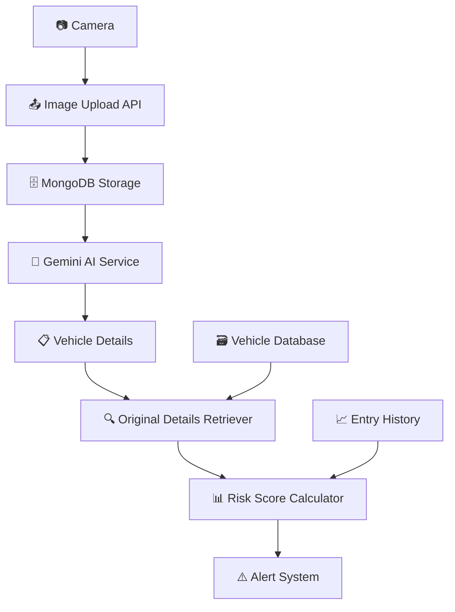

# Car Suspicion Alerter System

A comprehensive real-time car monitoring and alerting system designed for security checkpoints in conflict areas in Israel. The system uses AI-powered image analysis to identify suspicious vehicles and calculate risk scores based on vehicle details and entry patterns.

## 🎯 Project Overview

This system monitors vehicles at security checkpoints by:
- Capturing vehicle images from cameras
- Extracting vehicle details using Google Gemini AI
- Cross-referencing with official vehicle databases
- Calculating risk scores based on multiple factors
- Alerting security personnel about suspicious vehicles

## 📁 Project Structure

```
Notification_System/
├── 📁 camera/                      # Camera control and image capture
│   ├── cemera_control.py          # Main camera controller
│   └── config.py                  # Camera configuration
├── 📁 distributing_images/        # Image upload and distribution API
│   ├── image_routes.py            # FastAPI routes for image handling
│   └── config.py                  # API configuration
├── 📁 Gemini_Service/             # AI image analysis service
│   ├── main.py                    # Service entry point
│   ├── manager.py                 # Main service manager
│   └── GenAPI.py                  # Google Gemini API integration
├── 📁 original_details_retriever/ # Vehicle database lookup service
│   ├── app/
│   │   ├── manager.py             # Service manager
│   │   └── retrieve_original_car_details.py
│   ├── requirements.txt           # Service dependencies
│   └── Dockerfile                 # Container configuration
├── 📁 risk_score/                 # Risk calculation service
│   ├── main.py                    # Service entry point
│   ├── score.py                   # Risk scoring algorithm
│   └── config.py                  # Scoring configuration
├── 📁 persister/                  # Data persistence layer
│   ├── writer.py                  # Database writer
│   └── config.py                  # Persistence configuration
├── 📁 utils/                      # Shared utilities
│   ├── kafka_objects/             # Kafka producers/consumers
│   ├── mongo_client/              # MongoDB connection utilities
│   └── elasticsearch/             # Elasticsearch utilities
├── 📁 Pictures/                   # Sample vehicle images
├── 📁 log/                        # Logging configuration
└──  .env                           # Environment variables
```

## 🔄 System Flow



## 🧩 Component Details

### 📷 Camera Service
- **Purpose**: Captures vehicle images at checkpoints
- **Technology**: Python with image processing
- **Output**: Uploads images to the distribution API

### 📤 Image Distribution API
- **Purpose**: Receives and stores vehicle images
- **Technology**: FastAPI with MongoDB GridFS
- **Features**: RESTful image upload/retrieval endpoints

### 🤖 Gemini AI Service
- **Purpose**: Extracts vehicle details from images
- **Technology**: Google Gemini Vision API
- **Extracts**: License plate, color, model, vehicle type
- **Output**: Structured vehicle data

### 🔍 Original Details Retriever
- **Purpose**: Validates vehicle details against official databases
- **Technology**: Kafka consumer/producer with external API integration
- **Features**: Cross-references license plates with government databases

### 📊 Risk Score Calculator
- **Purpose**: Calculates suspicion scores based on multiple factors
- **Factors**: 
  - Vehicle detail mismatches
  - Entry frequency patterns
  - Historical behavior
- **Output**: Risk score (0-100) with alert recommendations

### 🗄️ Data Persistence
- **MongoDB**: Stores images and vehicle records
- **Elasticsearch**: Indexes searchable vehicle data
- **Kafka**: Handles real-time message streaming between services

## 🚀 Quick Start - Local Development

### Prerequisites
- Python 3.8+
- MongoDB
- Kafka
- Elasticsearch (optional)

### 1. Environment Setup
```bash
# Clone the repository
git clone <repository-url>
cd Notification_System

# Copy and configure environment variables
cp .env.example .env
# Edit .env with your API keys and database connections
```

### 2. Manual Setup (Alternative)
```bash
# Create virtual environment
python -m venv .venv
.venv\Scripts\activate

# Install dependencies
pip install -r original_details_retriever/requirements.txt
pip install fastapi uvicorn python-dotenv

# Start services individually
python route/route.py
python risk_score/main.py
python persister/writer.py
python original_details_retriever/app/manager.py
python Gemini_Service/main.py
python distributing_images/image_routes.py
python camera/cemera_control.py
```

### 3. Verify Installation
- Image API: http://localhost:8001/docs
- Upload test image: POST to http://localhost:8001/upload-image
- Check service logs in individual command windows

## 🐳 Docker Deployment

*Coming Soon - Docker configuration will be added here*

```bash
# Future Docker commands will be:
# docker-compose up -d
# docker-compose logs -f
```

## 📊 Monitoring & Alerts

The system provides real-time monitoring through:
- Service-specific log windows
- Kafka message tracking
- MongoDB document storage
- Risk score alerts above configurable thresholds

## 🔧 Configuration

Key configuration files:
- `.env` - Environment variables and API keys
- `*/config.py` - Service-specific configurations
- `original_details_retriever/requirements.txt` - Python dependencies

## 🛡️ Security Considerations

- API keys stored in environment variables
- Database connections secured
- Image data encrypted in transit
- Access logs maintained for audit trails